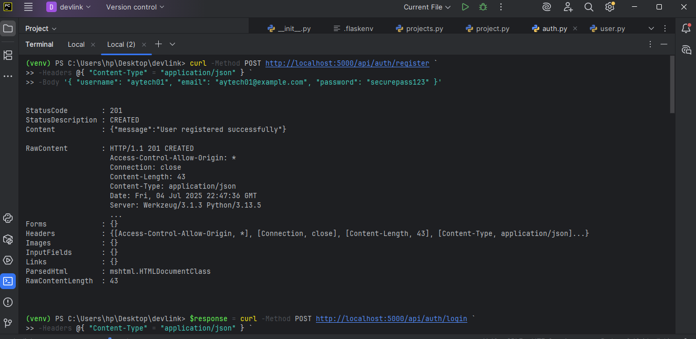
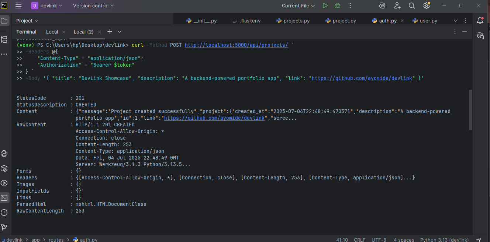

# 🚀 DevLink — Portfolio Project API

DevLink is a **JWT-authenticated backend API** built with **Flask** and **SQLAlchemy**, designed to power a personal developer portfolio. It lets users securely register, log in, and manage their software projects — ideal for showcasing your work, especially as a backend developer.

---

## 🛠 Features

- ✅ User registration & login with hashed passwords
- ✅ JWT-based authentication (`access_token`)
- ✅ Full CRUD for projects (title, description, link)
- ✅ Authenticated profile view (`/auth/me`)
- ✅ Public project viewer by ID
- ✅ Admin-only routes for managing users
- ✅ Clean, modular structure for scalability
- ✅ CORS-enabled for frontend integration

---

## 📁 Folder Structure

```
devlink/
├── app/
│   ├── __init__.py
│   ├── models.py
│   ├── routes/
│   │   ├── auth.py
│   │   ├── projects.py
│   │   └── admin.py
│   ├── schemas/
│   │   ├── user.py
│   │   └── project.py
├── .env
├── run.py
├── requirements.txt
```

---

## 🔐 Authentication Flow

- Register: `POST /api/auth/register`
- Login: `POST /api/auth/login` → returns `access_token`
- Authenticated endpoints require:
  ```
  Authorization: Bearer <access_token>
  ```

---

## 🎯 API Endpoints

### 🔑 Auth
| Method | Endpoint             | Description         |
|--------|----------------------|---------------------|
| POST   | `/api/auth/register` | Register a user     |
| POST   | `/api/auth/login`    | Login user          |
| GET    | `/api/auth/me`       | Get current profile |

### 🧠 Projects
| Method | Endpoint                  | Description             |
|--------|---------------------------|-------------------------|
| POST   | `/api/projects/`          | Create new project      |
| GET    | `/api/projects/`          | List user’s projects    |
| GET    | `/api/projects/<id>`      | View project (public)   |
| PUT    | `/api/projects/<id>`      | Update your project     |
| DELETE | `/api/projects/<id>`      | Delete your project     |

### 🛡 Admin
| Method | Endpoint                   | Description           |
|--------|----------------------------|-----------------------|
| GET    | `/api/admin/users`         | List all users        |
| DELETE | `/api/admin/users/<id>`    | Delete a user account |

---

## 💻 Tech Stack

- Python 3.13+
- Flask
- Flask-JWT-Extended
- Flask-CORS
- SQLAlchemy
- Marshmallow
- SQLite (local) / PostgreSQL (optional)

---

## 🧪 Sample `curl` Tests

### Register
```bash
curl -X POST http://localhost:5000/api/auth/register \
-H "Content-Type: application/json" \
-d '{"username": "aytech", "email": "aytech@example.com", "password": "123456"}'
```

### Login & Copy Token
```bash
curl -X POST http://localhost:5000/api/auth/login \
-H "Content-Type: application/json" \
-d '{"email": "aytech@example.com", "password": "123456"}'
```

### Create Project
```bash
curl -X POST http://localhost:5000/api/projects/ \
-H "Authorization: Bearer <TOKEN>" \
-H "Content-Type: application/json" \
-d '{"title": "Flask API", "description": "Backend powered portfolio", "link": "https://github.com/yourusername/devlink"}'
```

---

## 🖼 Screenshots

> ✅ Add screenshots below once you test successfully

| Registration | Project View |
|--------------|--------------|
|  |  |

---

## 🚀 Deployment (Optional)

Deploy it with:

- **Render**
- **Railway**
- **PythonAnywhere**
- or host the SQLite version locally

---

## 📌 How to Run Locally

```bash
git clone https://github.com/Ay-developerweb/devlink.git
cd devlink
python -m venv venv
venv\Scripts\activate  # Windows
pip install -r requirements.txt
flask run
```

Create `.env`:

```ini
JWT_SECRET_KEY=your-secret-key
DATABASE_URL=sqlite:///devlink.db
```

---

## 👤 Author

**Adediran Ayomide**  
📧 ayomide@example.com  
🐙 [GitHub](https://github.com/Ay-developerweb)  
🌐 [Portfolio](https://your-portfolio.com)

---

## ⭐ License

This project is open-source and free to use under the [MIT License](LICENSE).
